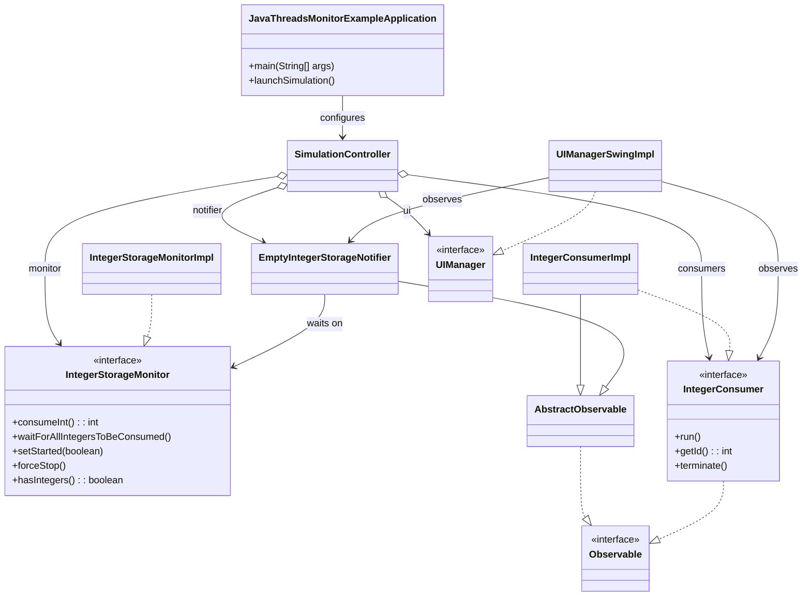
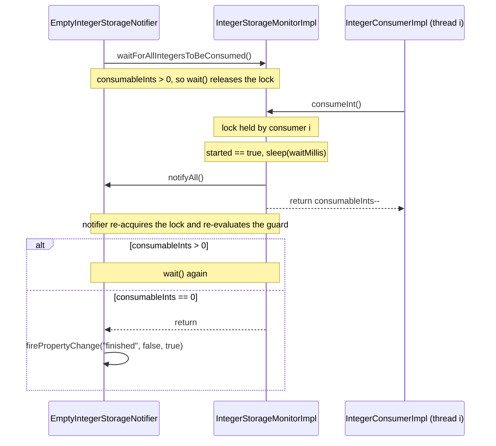
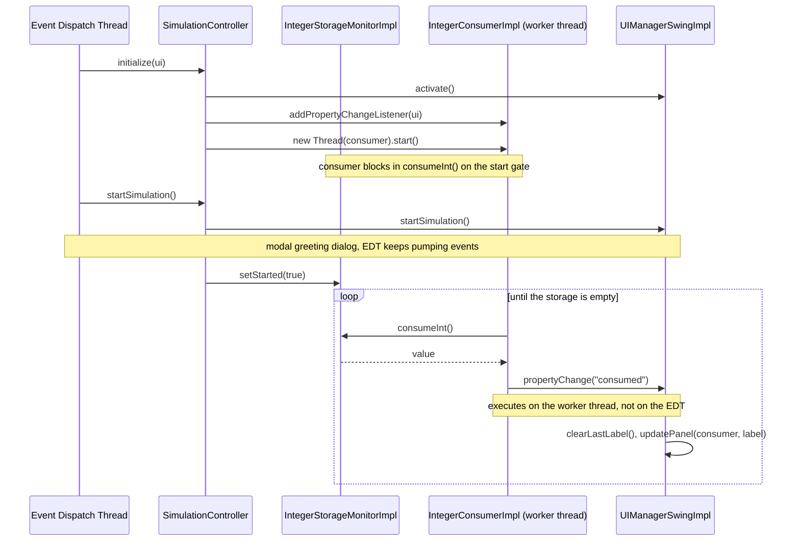

[](https://dl.circleci.com/status-badge/redirect/circleci/2e6Hm8LHAzuw5AQRrJLyG6/UoewhgzBXwCsmVqmb3sy5o/tree/master)
[](https://github.com/lpenap/java-monitor-example/actions/workflows/maven.yml)
[](//github.com/lpenap/java-monitor-example/releases/latest)


# Java Monitor Example

A worked example of the [monitor synchronization construct](https://en.wikipedia.org/wiki/Monitor_(synchronization)) in Java. A fixed pool of integers is consumed exactly once each by a set of competing threads, while a Swing user interface observes the threads and renders the contention as it happens. The project is intentionally small so that every concept it covers can be traced to a single class.

## Quickstart

#### Requirements
* JDK 25

Clone and run the project with:
```bash
git clone git@github.com:lpenap/java-monitor-example.git
cd java-monitor-example
./mvnw spring-boot:run
```
Running the project renders a graphic interface with a visual representation of the simulation:
* The main window shows a grid of random-colored panels, one per consumer thread.
* The window *observes* each *observable* `IntegerConsumerImpl` and updates the matching panel with the integer that thread just consumed.
* The window also observes an `EmptyIntegerStorageNotifier` to detect when every integer has been consumed.

## Problem statement

Several threads want to consume data from the same place, and each piece of data may be consumed at most once. Two properties must therefore hold at all times:

1. **Mutual exclusion.** At most one thread may read-and-remove an item at any given moment; otherwise two threads could take the same item.
2. **Condition synchronization.** Some threads need to *wait* for a state change (for example, "the storage is empty" or "the simulation has started") and be *woken up* when it happens, without spinning.

The classic solution to both is the **monitor**: an object that bundles shared state, the procedures that operate on it, an implicit mutual-exclusion lock, and one or more condition variables.

### This example

The simulation holds a finite quantity of integers (15 by default) consumed by a fixed number of threads (9 by default), with an artificial delay per consumption (500 ms by default) so that the contention is visible to a human. A separate thread waits until the storage is drained and reports it. All defaults live in `Constants`.

| Class | Role |
|---|---|
| `IntegerStorageMonitorImpl` | The **monitor**. Owns the integers and the only methods that touch them. Implemented as a singleton. |
| `IntegerConsumerImpl` | A **consumer**. A `Runnable` that competes for the monitor's lock and consumes integers until none remain. One thread per instance. |
| `EmptyIntegerStorageNotifier` | A **waiter**. A `Runnable` that blocks inside the monitor until the storage is empty, then notifies its observers. |
| `SimulationController` | The **composition root**. Creates the monitor, the notifier and the consumers, wires the UI as observer, and launches the threads. |
| `UIManagerSwingImpl` | The **observer**. A Swing window that reacts to events fired by consumers and by the notifier. |

### Class diagram



## Topics covered

Each topic below follows the same outline: the concept, how this project implements it (with the actual source), and a short discussion of the design decisions and their trade-offs. If you are unsure where to start reading the code, begin with `JavaThreadsMonitorExampleApplication`, since the project is bootstrapped with Spring Boot.

1. [Singleton pattern](#1-singleton-pattern)
2. [Monitor synchronization and mutual exclusion](#2-monitor-synchronization-and-mutual-exclusion)
3. [Runnables and thread launching](#3-runnables-and-thread-launching)
4. [Thread waiting and signaling](#4-thread-waiting-and-signaling)
5. [Observer pattern with `PropertyChangeListener`](#5-observer-pattern-with-propertychangelistener)
6. [Putting it together: Observer, the UI and the threads](#6-putting-it-together-observer-the-ui-and-the-threads)

## 1. Singleton pattern

### Concept

A Singleton guarantees that a class has exactly one instance and provides a single, global point of access to it. The canonical ingredients are a non-public constructor, a private static field holding the instance, and a static accessor that lazily creates the instance on first use.

### Implementation

All consumers must draw from the *same* storage, so `IntegerStorageMonitorImpl` is a Singleton:

```java
public class IntegerStorageMonitorImpl implements IntegerStorageMonitor {
	private static IntegerStorageMonitor _instance = null;
	private int consumableInts;
	private int waitMillis;
	private boolean started;
	private boolean forceStop;

	protected IntegerStorageMonitorImpl(int consumableInts, int waitMillis) {
		this.consumableInts = consumableInts;
		this.started = false;
		this.forceStop = false;
		this.waitMillis = waitMillis;
	}

	public static IntegerStorageMonitor instance(int consumableInts, int waitMillis) {
		if (_instance == null) {
			_instance = new IntegerStorageMonitorImpl(consumableInts, waitMillis);
		}
		return _instance;
	}
	// ...
}
```

`SimulationController` follows the same recipe with a no-argument `instance()` method, so the application has exactly one controller and exactly one storage.

### Discussion

* **Lazy initialisation is not thread-safe by itself.** Two threads calling `instance()` concurrently before `_instance` is set could each create an object. It is acceptable here because the singleton is created by `SimulationController.initialize()` on the AWT Event Dispatch Thread *before* any worker thread exists. A production implementation would use an enum, a static holder class, or double-checked locking with a `volatile` field.
* **Arguments are honoured only once.** After the first call, `instance(consumableInts, waitMillis)` ignores its parameters. The tests reset the private `_instance` field through reflection to obtain a fresh monitor per test.
* The accessor returns the `IntegerStorageMonitor` *interface*, so callers never depend on the concrete class. This is what allows `SimulationControllerTests` to inject a fake monitor.

## 2. Monitor synchronization and mutual exclusion

### Concept

A monitor, as introduced by Hoare and Brinch Hansen, is a module that encapsulates shared data together with the only procedures allowed to operate on it, and guarantees that at most one thread executes any of those procedures at a time. Threads that need to wait for a condition inside the monitor do so on a *condition variable*, releasing the lock while they sleep.

Java offers this construct natively:

* Every object owns an **intrinsic lock** (a "monitor" in JVM terminology).
* Declaring a method `synchronized` makes it acquire that lock on entry and release it on exit. The set of `synchronized` methods of an object therefore forms one monitor.
* The object itself doubles as its single condition variable through `wait()`, `notify()` and `notifyAll()`, which may only be called while holding the lock.
* When the lock is released, all blocked threads compete for it and the scheduler decides who enters. The choice is non-deterministic.

### Implementation

`IntegerStorageMonitorImpl` protects three pieces of shared state: the remaining count `consumableInts`, the start gate `started`, and the cancellation flag `forceStop`. Every method that reads or writes them is `synchronized`, so no invariant can be observed in a half-updated state.

```java
	@Override
	public synchronized int consumeInt() throws InterruptedException, ForcedStopException {
		while (!started) {
			wait();
			if (forceStop) {
				throw new ForcedStopException();
			}
		}
		Thread.sleep(waitMillis);
		notifyAll();
		return consumableInts > 0 ? consumableInts-- : 0;
	}

	@Override
	public synchronized void waitForAllIntegersToBeConsumed() throws InterruptedException, ForcedStopException {
		while (this.consumableInts > 0) {
			wait();
			if (forceStop) {
				throw new ForcedStopException();
			}
		}
	}

	@Override
	public synchronized void setStarted(boolean started) {
		this.started = started;
		notifyAll();
	}

	@Override
	public synchronized void forceStop() {
		forceStop = true;
		notifyAll();
	}

	@Override
	public synchronized boolean hasIntegers() {
		return consumableInts > 0;
	}
```

The critical section is `consumableInts--`: because it executes under the lock, two consumers can never decrement from the same value, which is exactly the "consume at most once" requirement.

### Discussion

* **Mesa semantics require a loop.** Java's `wait()` follows Mesa (signal-and-continue) rather than Hoare (signal-and-wait) semantics: a woken thread is not guaranteed that the condition still holds by the time it re-acquires the lock, and spurious wake-ups are permitted. This is why both waits are written as `while (condition) wait();` and never as `if`.
* **Sleeping while holding the lock is deliberate here and wrong elsewhere.** `Thread.sleep(waitMillis)` inside `consumeInt()` keeps the lock held for half a second so that a human can see one panel at a time light up. In real code, holding a lock while blocking is a classic throughput killer; the delay would be moved outside the `synchronized` region.
* `hasIntegers()` is `synchronized` too, so the read of `consumableInts` is guaranteed to see the latest write from any other thread. Without the lock (or `volatile`) the Java Memory Model would allow a stale read.

## 3. Runnables and thread launching

### Concept

The elementary way to run code concurrently in Java is to implement `Runnable`, hand an instance to a `Thread`, and call `start()`. The JVM then invokes `run()` on a new thread of execution. The `Runnable` is responsible for terminating cleanly: a thread stuck in a loop is never garbage-collected, regardless of whether anyone still holds a reference to it.

### Implementation

Consumers are described by an interface that combines `Runnable` with the project's `Observable` (see topic 5):

```java
public interface IntegerConsumer extends Runnable, Observable {

	void run();

	int getId();

	void terminate();

}
```

The implementation loops while it is allowed to run and the storage is non-empty, consuming one integer per iteration and reporting it to its observers:

```java
public class IntegerConsumerImpl extends AbstractObservable implements IntegerConsumer {

	private IntegerStorageMonitor monitor;
	private int id;
	private boolean running;
	private int consumedInt;

	public IntegerConsumerImpl(IntegerStorageMonitor monitor, int id) {
		super();
		this.monitor = monitor;
		this.id = id;
		this.running = true;
	}

	@Override
	public void run() {
		try {
			while (running && monitor.hasIntegers()) {
				processInteger(monitor.consumeInt());
			}
		} catch (InterruptedException ignored) {
		} catch (ForcedStopException forcedStopException) {
			getSupport().firePropertyChange(Constants.STOP, running, !running);
			this.running = !running;
		} finally {
			removeAllListeners();
		}
	}

	private void processInteger(int consumed) throws InterruptedException {
		getSupport().firePropertyChange(Constants.CONSUMED, this.consumedInt, consumed);
		this.consumedInt = consumed;
	}

	@Override
	public int getId() {
		return this.id;
	}

	@Override
	public void terminate() {
		this.running = false;
	}

}
```

`SimulationController.initialize()` launches one thread for the notifier and one per consumer, registering the UI as observer before each `start()` so that no event can be missed:

```java
	public void initialize(UIManager userInterface) {
		// Instantiate our integer storage with some integers.
		intStorage = IntegerStorageMonitorImpl.instance(integersToConsume, simulationStepMillis);

		// Launch the notifier.
		emptyStorageNotifier = new EmptyIntegerStorageNotifier(intStorage);
		(new Thread(emptyStorageNotifier)).start();

		// create main interface
		this.userInterface = userInterface;
		this.userInterface.activate();

		// Register main interface as an observer on the storage notifier
		emptyStorageNotifier.addPropertyChangeListener(this.userInterface);

		// Launch all consumer threads.
		consumers = new ArrayList<>();
		for (int i = 0; i < consumersQuantity; i++) {
			IntegerConsumer consumer = new IntegerConsumerImpl(intStorage, i);
			consumer.addPropertyChangeListener(this.userInterface);
			consumers.add(consumer);
			(new Thread(consumer)).start();
		}
	}
```

### Discussion

* **Cooperative termination.** There is no way to kill a Java thread safely; instead the consumer checks a `running` flag on every iteration and `terminate()` clears it. `SimulationController.stopSimulation()` simply calls `terminate()` on every consumer. Strictly, `running` should be `volatile`: `terminate()` writes it without holding any lock, so the Java Memory Model does not guarantee that the worker ever observes the change. In practice the worker re-reads the field after each `synchronized` call into the monitor and current JVMs do not cache it across that boundary, but a correct program would not rely on this.
* **Interruption.** `wait()` and `sleep()` throw `InterruptedException`. The consumer treats interruption as a request to exit and lets `run()` return, which ends the thread.
* **A benign check-then-act race.** `hasIntegers()` and `consumeInt()` are two separate lock acquisitions. Two consumers may both observe "one integer left", after which one of them receives `0`. The monitor makes this harmless by returning `0` as a sentinel instead of going negative, and the UI renders that sentinel as the word "finished". Merging the two calls into a single `synchronized` method would remove the race entirely; it is left in place because it is instructive.
* **Cleanup in `finally`.** Whatever the exit path, the consumer removes its listeners so that the UI is not retained by a dead thread.

## 4. Thread waiting and signaling

### Concept

A *guarded wait* is the idiom `while (!condition) wait();` executed inside a monitor. The waiting thread releases the lock, sleeps until another thread calls `notify()` or `notifyAll()` on the same object, re-acquires the lock, and re-evaluates the guard. `notifyAll()` is preferred whenever several threads may be waiting on *different* conditions of the same monitor, because `notify()` might wake the wrong one and leave the intended thread asleep forever.

### Implementation

The monitor contains three guarded waits, each serving a different purpose:

| Guard | Where | Who waits | Who signals | Purpose |
|---|---|---|---|---|
| `while (!started)` | `consumeInt()` | every consumer, at startup | `setStarted(true)`, called from the UI thread after the user dismisses the greeting dialog | A **start gate**: all consumers are parked and released simultaneously, maximising contention. |
| `while (consumableInts > 0)` | `waitForAllIntegersToBeConsumed()` | `EmptyIntegerStorageNotifier` | `consumeInt()`, after every consumption | A **drain wait**: the notifier wakes on each consumption, re-checks, and exits only when the storage is empty. |
| `if (forceStop) throw` after each `wait()` | both methods | anyone waiting | `forceStop()` | **Cancellation**: waiters are woken and unwind through `ForcedStopException` instead of returning normally. |

The notifier is the simplest possible `Runnable` built on a guarded wait:

```java
public class EmptyIntegerStorageNotifier extends AbstractObservable implements Runnable {

	private IntegerStorageMonitor intStorage;

	public EmptyIntegerStorageNotifier(IntegerStorageMonitor intStorage) {
		super();
		this.intStorage = intStorage;
	}

	@Override
	public void run() {
		try {
			intStorage.waitForAllIntegersToBeConsumed();
			getSupport().firePropertyChange(Constants.FINISHED, false, true);
		} catch (InterruptedException ignored) {
		} catch (ForcedStopException ignored) {
		} finally {
			removeAllListeners();
		}
	}
}
```

One consumption cycle, seen from the monitor:



### Discussion

* **Why `notifyAll()` everywhere.** Consumers waiting on `started` and the notifier waiting on `consumableInts` share the same intrinsic lock and therefore the same wait set. A `notify()` in `setStarted()` could wake the notifier instead of a consumer, and the simulation would stall. `notifyAll()` costs a few redundant wake-ups but is always correct.
* **The start gate is a barrier.** Parking every consumer on `started` and releasing them at once is what makes the first few hundred milliseconds of the simulation interesting: nine threads race for a lock that only one can hold.
* **Cancellation as an exception.** `forceStop()` does not itself throw; it sets a flag and wakes everyone. Each waiter checks the flag immediately after `wait()` returns and throws. This keeps the cancellation decision inside the monitor, where the state is protected, and lets each `Runnable` decide how to react in its `catch` block.

## 5. Observer pattern with `PropertyChangeListener`

### Concept

The Observer pattern (Gamma et al.) defines a one-to-many dependency: when a *subject* changes state, all registered *observers* are notified automatically, without the subject knowing anything about them beyond a notification interface. The JDK ships a ready-made implementation in `java.beans`: a subject holds a `PropertyChangeSupport`, observers implement `PropertyChangeListener`, and events carry a property name plus old and new values.

### Implementation

The project defines its own small `Observable` interface so that subjects can be treated uniformly:

```java
public interface Observable {

	PropertyChangeSupport getSupport();

	void addPropertyChangeListener(PropertyChangeListener pcl);

	void removePropertyChangeListener(PropertyChangeListener pcl);

}
```

`AbstractObservable` implements it once by delegating to `PropertyChangeSupport`, and adds a helper to detach every listener:

```java
public abstract class AbstractObservable implements Observable {
	protected PropertyChangeSupport support;

	public AbstractObservable() {
		super();
		this.support = new PropertyChangeSupport(this);
	}

	@Override
	public PropertyChangeSupport getSupport() {
		return this.support;
	}

	@Override
	public void addPropertyChangeListener(PropertyChangeListener pcl) {
		support.addPropertyChangeListener(pcl);
	}

	@Override
	public void removePropertyChangeListener(PropertyChangeListener pcl) {
		support.removePropertyChangeListener(pcl);
	}

	protected void removeAllListeners() {
		Iterator<PropertyChangeListener> i = Arrays.asList(support.getPropertyChangeListeners().clone()).iterator();
		while (i.hasNext()) {
			support.removePropertyChangeListener(i.next());
		}
	}

}
```

Both worker types extend it. The vocabulary of events is fixed in `Constants`:

| Property name | Fired by | Old value → new value | Meaning |
|---|---|---|---|
| `consumed` | `IntegerConsumerImpl.processInteger()` | previous integer → integer just consumed | A consumer acquired the lock and took an integer. |
| `finished` | `EmptyIntegerStorageNotifier.run()` | `false` → `true` | The storage is empty. |
| `stop` | `IntegerConsumerImpl.run()` | `true` → `false` | The consumer was cancelled through `forceStop()`. |

### Discussion

* **Equal old and new values are silently dropped.** `PropertyChangeSupport.firePropertyChange` does not deliver an event when `oldValue.equals(newValue)`. This is safe for `consumed` because the sequence of integers is strictly decreasing, and for `finished` and `stop` because they flip a boolean exactly once. It is worth remembering when reusing the pattern for values that may repeat.
* **The subject knows nothing about Swing.** `IntegerConsumerImpl` and `EmptyIntegerStorageNotifier` depend only on `java.beans`. The user interface could be replaced by a console logger, a test double, or nothing at all without touching them.
* **Listener removal prevents leaks.** `removeAllListeners()` is called in every `finally` block, so a finished thread does not keep the window (and everything it references) reachable through the `PropertyChangeSupport`. Cloning the listener array first avoids modifying the collection while iterating over it.

## 6. Putting it together: Observer, the UI and the threads

The previous topics are independent building blocks. This one explains how they meet at runtime, and in particular *on which thread* each piece of code executes, which is the question that decides whether a GUI program is correct.

### Wiring

The entry point runs Spring Boot in non-headless mode and then hands over to the AWT Event Dispatch Thread (EDT):

```java
	public static void main(String[] args) {
		var ctx = new SpringApplicationBuilder(JavaThreadsMonitorExampleApplication.class).headless(false).run(args);

		EventQueue.invokeLater(() -> {
			var ex = ctx.getBean(JavaThreadsMonitorExampleApplication.class);
			ex.launchSimulation();
		});
	}
```

`launchSimulation()` therefore executes on the EDT. It configures the controller, creates the Swing window, and calls `initialize()` followed by `startSimulation()`. As shown in topic 3, `initialize()` registers the window as a `PropertyChangeListener` on the notifier and on every consumer *before* starting their threads, so registration and thread start are ordered and no event can be lost.

### Event routing

The window receives every event through a single method and dispatches on the property name. For `consumed` events it recovers the emitting consumer from `event.getSource()` and uses its `getId()` as the index of the panel to update:

```java
	@Override
	public void propertyChange(PropertyChangeEvent event) {
		String propertyName = event.getPropertyName();

		if ("finished".equals(propertyName)) {
			JOptionPane.showMessageDialog(frame, "All Integers Consumed!");
			log.info("All Integers Consumed!");

		} else if ("consumed".equals(propertyName)) {
			int intConsumed = (int) event.getNewValue();
			String newLabel = intConsumed == 0 ? "finished" : "" + intConsumed;
			clearLastLabel();
			updatePanel((IntegerConsumer) event.getSource(), newLabel);
		}
	}
```

`clearLastLabel()` blanks the previously updated panel before `updatePanel()` writes the new one, so at any instant exactly one panel shows a number: a direct visualisation of the fact that exactly one thread holds the monitor's lock.

### Threading model

The essential observation is that **`firePropertyChange` is synchronous**. `PropertyChangeSupport` invokes each listener's `propertyChange()` on the thread that fired the event, and returns only when the listener has returned. Consequently:

* `propertyChange("consumed")` runs on the **consumer thread** that just left `consumeInt()`.
* `propertyChange("finished")` runs on the **notifier thread**.
* Neither runs on the EDT, even though both touch Swing components.



Swing's threading rule states that components must be created and modified only on the EDT. The example bends that rule knowingly:

* `updatePanel()` is declared `synchronized`, which serialises the nine consumer threads *with respect to each other*, and the only mutation is `JLabel.setText()`, which in practice repaints safely because `setText` enqueues its own repaint on the EDT. This is why the demo works reliably, but it relies on implementation details rather than on the contract.
* `JOptionPane.showMessageDialog()` for the `finished` event blocks the notifier thread rather than the EDT, which is harmless here because the notifier has nothing else to do.

The textbook-correct version of `propertyChange()` would marshal the work back to the EDT:

```java
	@Override
	public void propertyChange(PropertyChangeEvent event) {
		SwingUtilities.invokeLater(() -> handleOnEventDispatchThread(event));
	}
```

It is left out of the example on purpose: keeping the listener synchronous makes the thread hand-off visible in a debugger and gives the reader something concrete to reason about. The trade-off is documented here rather than hidden.

### Why the decoupling pays off

Because the worker threads depend only on `Observable`, and the window depends only on `IntegerConsumer` and `PropertyChangeEvent`, the two halves can be exercised independently:

* `SimulationControllerTests` replaces the Swing window with a `DummyUI` that implements `UIManager` and records the calls it receives. The controller, the monitor and the consumers run unchanged under JUnit with no display attached.
* The UI package is excluded from coverage measurement precisely because it is the only part that cannot be driven headlessly, and the decoupling keeps that part small.

## References

* C. A. R. Hoare, ["Monitors: An Operating System Structuring Concept"](https://dl.acm.org/doi/10.1145/355620.361161), *Communications of the ACM*, 1974.
* The Java Language Specification, [Chapter 17: Threads and Locks](https://docs.oracle.com/javase/specs/jls/se25/html/jls-17.html).
* The Java Tutorials, [Concurrency: Synchronized Methods](https://docs.oracle.com/javase/tutorial/essential/concurrency/syncmeth.html) and [Guarded Blocks](https://docs.oracle.com/javase/tutorial/essential/concurrency/guardmeth.html).
* E. Gamma, R. Helm, R. Johnson, J. Vlissides, *Design Patterns: Elements of Reusable Object-Oriented Software*, 1994. Chapter 5, "Observer".
* The Java Tutorials, [Concurrency in Swing](https://docs.oracle.com/javase/tutorial/uiswing/concurrency/index.html).
* API documentation: [`Runnable`](https://docs.oracle.com/en/java/javase/25/docs/api/java.base/java/lang/Runnable.html), [`Thread`](https://docs.oracle.com/en/java/javase/25/docs/api/java.base/java/lang/Thread.html), [`PropertyChangeListener`](https://docs.oracle.com/en/java/javase/25/docs/api/java.desktop/java/beans/PropertyChangeListener.html), [`PropertyChangeSupport`](https://docs.oracle.com/en/java/javase/25/docs/api/java.desktop/java/beans/PropertyChangeSupport.html).
